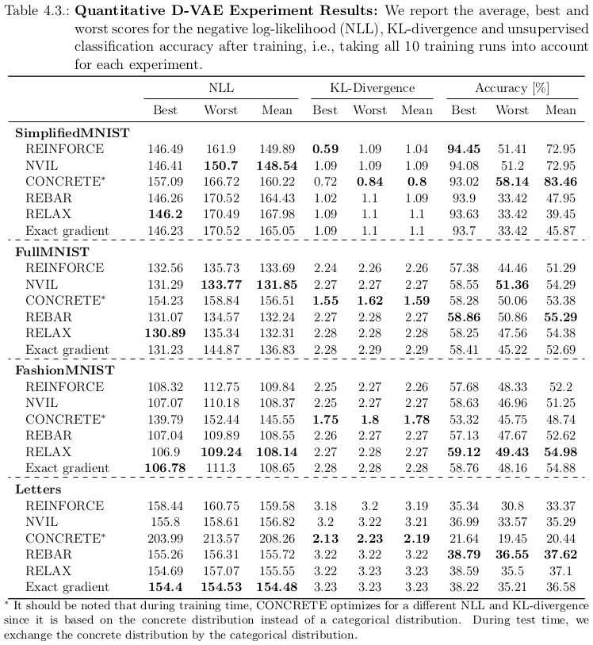
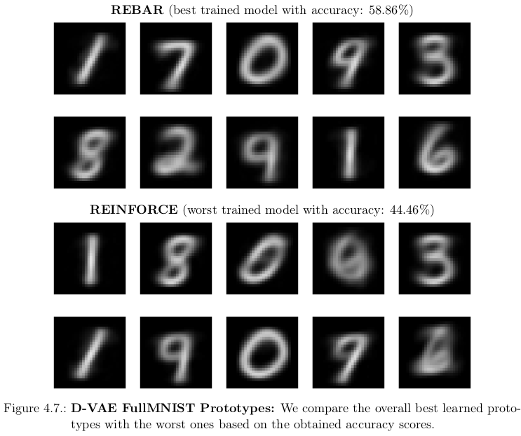
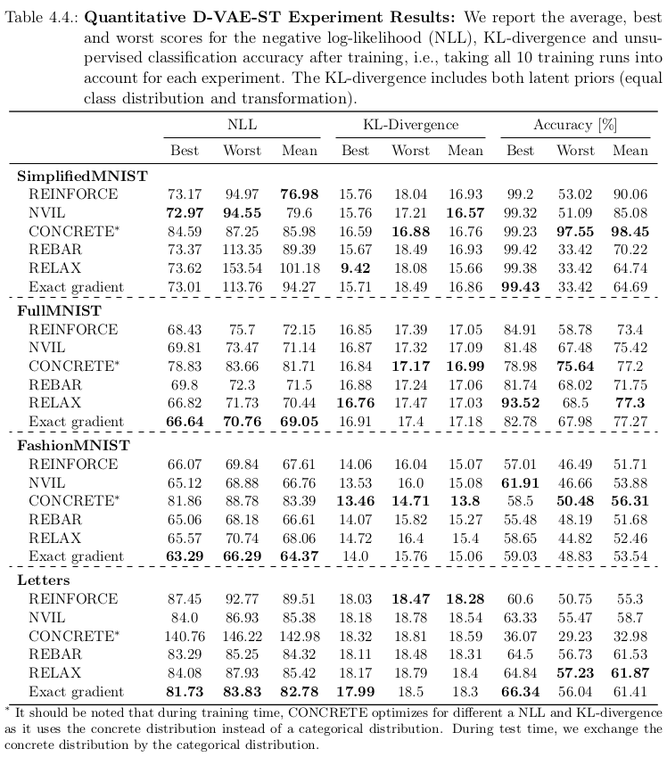
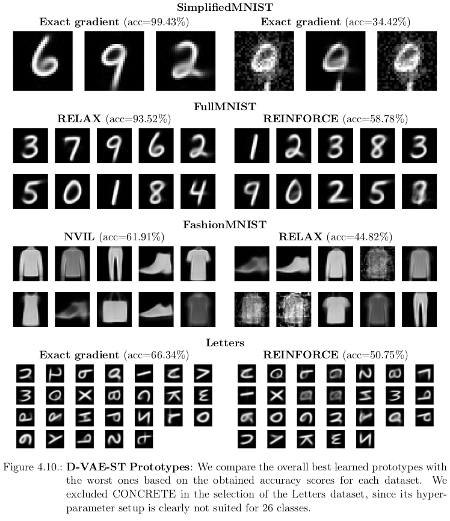
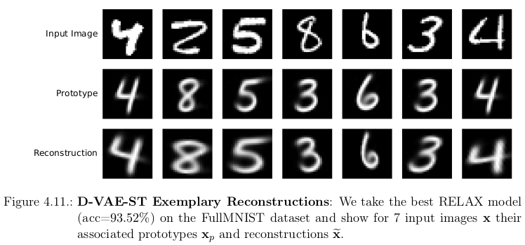
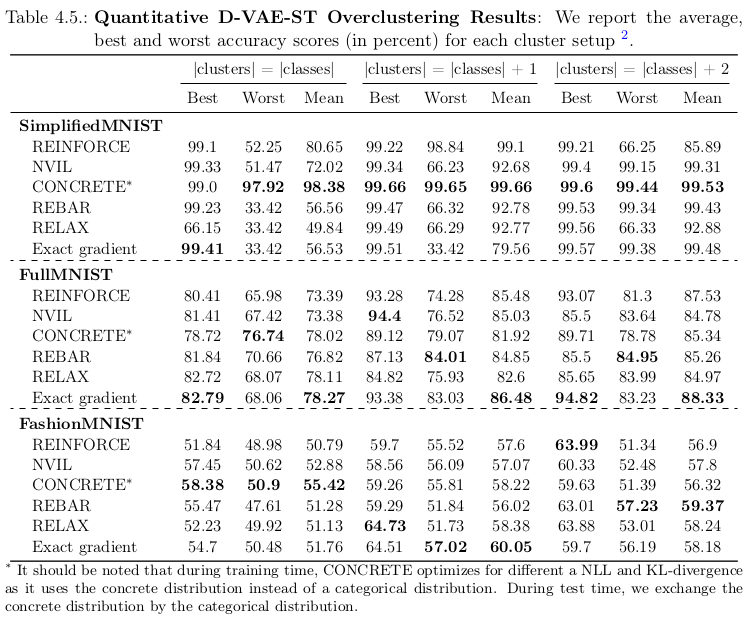
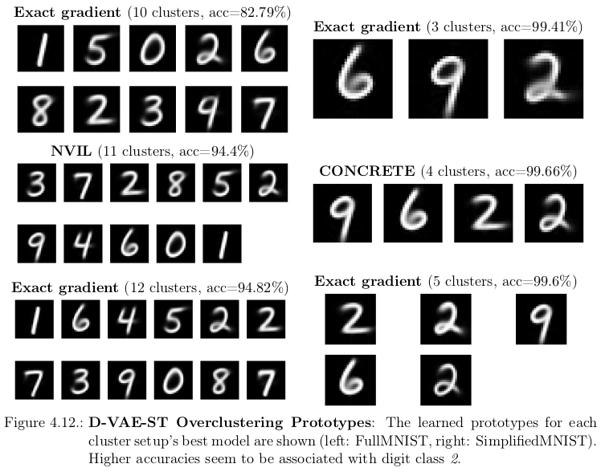
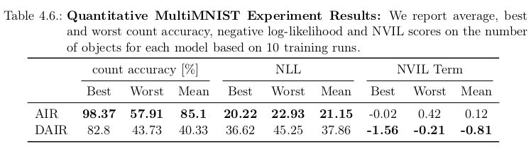
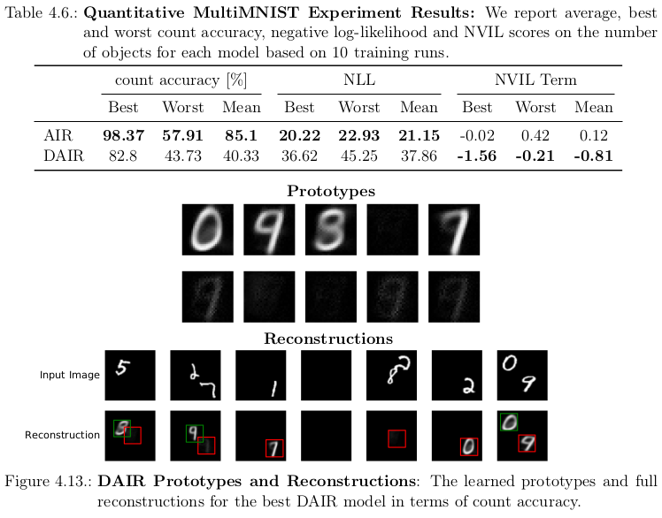
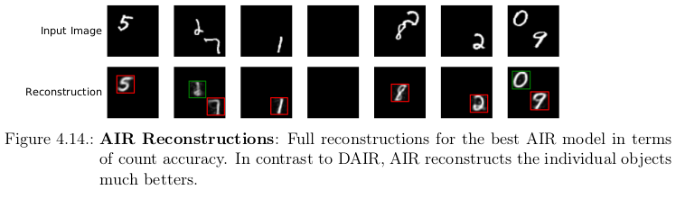

# Structured Image Decompositions
[](https://travis-ci.com/borea17/StrImaDec)

**[Main Takeaways](https://github.com/borea17/StrImaDec#main-takeaways-aka-tldr)** | **[Results](https://github.com/borea17/StrImaDec#results)** | **[How to use this repository](https://github.com/borea17/StrImaDec#how-to-use-this-repository)**

-------------------------------------------------------------------------------------

This repository contains the implementation for my thesis 

* Structured Image Decompositions using Unsupervised Object-Centric Learning

*Abstract*: 

>Object-centered perception lays the foundation of human intelligence and may be
>the key to general artificial intelligence. Despite recent advances, artificial
>vision systems that decompose images into objects and their relations without
>any supervision lack real-world applicability and only work on simplistic
>datasets. While there are multiple reasons associated to this obstacle, we
>hypothesize that integrating a multi-class paradigm into object-structured
>representations is an essential prerequisite to model the variability of
>real-world images. In this thesis, we present and test novel generative
>models that aim to retrieve a multi-class representation from raw images
>without any supervision by interpreting objects as prototype modifications.
>For single-object datasets such as MNIST, these approaches can equally be
>used for image clustering. Despite its simplicity, our best model discovers
>clusters that match the original MNIST classes with an accuracy of 93.52\%.
>This accuracy can be obtained by simply labeling the prototype images which
>highlights the interpretability of our models.

## Main Takeaways a.k.a. TL;DR

1. **One class to rule them all - Why we need a multi-class paradigm:**  
    To the best of our knowledge, all previous works assumes in some way that objects within an image originate from the same class. While a class can be arbitrary complex (i.e., the number of attributes in the latent space could be arbitrary large), it seems rather unnatural and inefficient to force an *one class to rule them all* paradigm. E.g., how should the attributes to generate different images of a *hand* relate to the attributes to generate images of *cars*?

2. **A multi-class paradigm introduces discreteness - Implementation of gradient estimators**:  
    The reparameterization trick ([Kingma & Welling, 2014](https://arxiv.org/abs/1312.6114), [Rezende et al., 2014](https://arxiv.org/abs/1401.4082)) is not applicable to discrete random nodes due to the associated discontinuous operations. Therefore, we implemented the following discrete gradient estimators (for a categorical distribution): 
    * [REINFORCE](https://github.com/borea17/StrImaDec/blob/main/strimadec/discrete_gradient_estimators/REINFORCE.py) ([Williams, 1992](https://link.springer.com/article/10.1007/BF00992696)), also known as score-function estimator, is an unbiased, high-variance estimator that is based on the log-derivative trick.
    * [NVIL](https://github.com/borea17/StrImaDec/blob/main/strimadec/discrete_gradient_estimators/NVIL.py) ([A. Minh & Gregor, 2014](https://arxiv.org/abs/1402.0030)) is basically a variant of REINFORCE with control variates, in which a neural baseline is used.
    * [CONCRETE](https://github.com/borea17/StrImaDec/blob/main/strimadec/discrete_gradient_estimators/CONCRETE.py) ([Maddison et al., 2017](https://arxiv.org/abs/1611.00712) and [Jang et al., 2017](https://arxiv.org/abs/1611.01144)) is based on the idea to approximate sampling from a discrete distribution via sampling from a **CON**tinuous relaxation of dis**CRETE** random variables.
    * [REBAR](https://github.com/borea17/StrImaDec/blob/main/strimadec/discrete_gradient_estimators/REBAR.py) ([Tucker et al., 2017](https://arxiv.org/abs/1703.07370)) combines the unbiased, high-variance REINFORCE estimator with the low-variance, but biased CONCRETE estimator as a control variate. 
    * [RELAX](https://github.com/borea17/StrImaDec/blob/main/strimadec/discrete_gradient_estimators/RELAX.py) ([Grathwohl et al, 2018](https://arxiv.org/abs/1711.00123)) combines the ideas of REBAR and NVIL by using a surrogate neural network to construct a control variate that aims at minimizing the variance.

3. **Variational Autoencoders (VAEs) with a discrete latent space learn prototypes**:  
    The concept of *prototypes* naturally arises in D-VAEs (discrete VAEs) due to the finite number of reconstructions. Intuitively, the D-VAE aims to reconstruct all images within the dataset **X** using only *K* (latent space dimension) realizations for the decoder distribution. Thus, it has to find class-associated prototypes in order to minimize the reconstruction error. More accurately, the generative process of a D-VAE assumes that each image is generated by sampling from one of those *K* distributions. 

    Due to their modeling assumptions, D-VAEs are highly limited in practice: Each image must be highly resembled by some prototype image. I.e., positional and/or shape variations are only included through the variance of the scene model.

4. **D-VAE with a Spatial Transformer (D-VAE-ST) - Objects are prototype modifications**:  
    To overcome the limitations of the D-VAE, we can include a spatial transformer that generates the reconstructed image by disturbing the prototype image using a latent (infered) transformation vector. Thereby, we can model positional and shape variations within the data.

    Although the D-VAE-ST is based on a more realistic generative model, it is still only applicable to simple 2D data in which the same texture is assumed for all objects within a class. For real-world applicability, it would be interesting to extend the prototype definition, e.g., we could define prototypes as three dimensional objects and infer the view to generate a reconstructed image.

5. **Discrete Attend-Infer-Repeat (DAIR) - A multi-object-multi-class model**:  
    We showed how the D-VAE-ST can be included into AIR ([Eslami et al., 2016](https://arxiv.org/abs/1603.08575)), an existing model that explicetly reasons about the number of objects. We term this adaptation DAIR and compared it against AIR on the MultiMNIST dataset. Ideally, after training DAIR should be able to locate and classify objects within an image in a purely unsupervised fashion. While the preliminary results for DAIR were rather poor, we expect that some modifications and a different hyperparameter setup could lead to significant improvements.

6. **Robustness is a problem**:  
    We observed that our approaches often get trapped into local minima. In future works, it would be interesting to study how we could make the training procedure more robust, e.g., using drop-out, batch-normalization and convolutional layers.


## Results

### D-VAE





### D-VAE-ST








### Overclustering (D-VAE-ST)





### Multi-Object-Multi-Class (AIR vs DAIR)








## How to use this repository 

This repository contains the whole implementation and experimental setups such that all results can easily be reproduced. 

### Installation

Simply clone the repository, create a virtual enviroment (not necessary, but advised), install the necessary packages and install the `strimadec` package.

```bash
git clone --depth 1 https://github.com/borea17/strimadec/
cd strimadec
python3 -m venv venv
source venv/bin/activate
pip install -r requirements.txt
python setup.py install
```

### Reproduce Results

After you successfully installed the repository, you can run the following commands to reproduce the thesis results:

```bash
# Toy Experiments
python strimadec/experiments/toy_experiment/01_replication_experiment.py \
    --num_epochs 10000 --num_repetitions 50
python strimadec/experiments/toy_experiment/02_toy_experiment.py \
    --num_epochs 5000 --num_repetitions 50
python strimadec/experiments/toy_experiment/03_hyperparameter_experiment.py \
    --num_epochs 5000 --num_repetitions 25

# Single-Object-Multi-Class Experiments
python strimadec/experiments/single_object_multi_class/01_DVAE_experiments.py \
    --num_epochs 150 --num_repetitions 10 --dataset_name 'SimplifiedMNIST' 
python strimadec/experiments/single_object_multi_class/01_DVAE_experiments.py \
    --num_epochs 150 --num_repetitions 10 --dataset_name 'FullMNIST' 
python strimadec/experiments/single_object_multi_class/01_DVAE_experiments.py \
    --num_epochs 150 --num_repetitions 10 --dataset_name 'FashionMNIST' 
python strimadec/experiments/single_object_multi_class/01_DVAE_experiments.py \
    --num_epochs 150 --num_repetitions 10 --dataset_name 'Letters'
python strimadec/experiments/single_object_multi_class/02_DVAEST_experiments.py \
    --num_epochs 150 --num_repetitions 10 --dataset_name 'SimplifiedMNIST'
python strimadec/experiments/single_object_multi_class/02_DVAEST_experiments.py \
    --num_epochs 150 --num_repetitions 10 --dataset_name 'FullMNIST' 
python strimadec/experiments/single_object_multi_class/02_DVAEST_experiments.py \
    --num_epochs 150 --num_repetitions 10 --dataset_name 'FashionMNIST' 
python strimadec/experiments/single_object_multi_class/02_DVAEST_experiments.py \
    --num_epochs 150 --num_repetitions 10 --dataset_name 'Letters' 
python strimadec/experiments/single_object_multi_class/03_DVAEST_overclustering_experiments.py \
    --num_epochs 150 --num_repetitions 5 --dataset_name 'SimplifiedMNIST' 
python strimadec/experiments/single_object_multi_class/03_DVAEST_overclustering_experiments.py \
    --num_epochs 150 --num_repetitions 5 --dataset_name 'FullMNIST' 
python strimadec/experiments/single_object_multi_class/03_DVAEST_overclustering_experiments.py \
    --num_epochs 150 --num_repetitions 5 --dataset_name 'FashionMNIST' 

# Multi-Object-Multi-Class Experiments
python strimadec/experiments/multi_object_multi_class/01_comparison_experiment.py \
    --num_epochs 200 --num_repetitions 10 --dataset_name 'MultiMNIST'
```

**WARNING**: Running all of the commands may take days and is not advised. 

All results (trained networks, plots and tensorboard directories) can be downloaded from [this google drive](https://drive.google.com/drive/folders/1LlEyW-94k4Me_NVeSytyCAk7Xmy9y9mU?usp=sharing) (about 15GB). Copy the downloaded folders into the respective folder under `strimadec/experiments/`, then you can run the scripts with the addendum `--load` in a few minutes. 

### Contributions

Contributions are welcome and if needed, I will provide a more detailed documentation.
